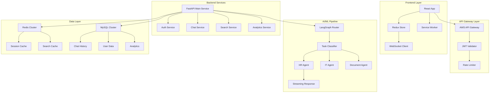

# Enterprise AI Assistant Architecture Design
## Scaling for 40,000 Associates

### Table of Contents
1. [Current State Analysis](#current-state-analysis)
2. [Target Architecture Overview](#target-architecture-overview)
3. [Component Deep Dive](#component-deep-dive)
4. [Data Management Strategy](#data-management-strategy)
5. [Performance & Scalability](#performance--scalability)
6. [Security Implementation](#security-implementation)
7. [AI/ML Pipeline](#aiml-pipeline)
8. [Implementation Roadmap](#implementation-roadmap)

---

## Current State Analysis

### Existing Application Structure
```
Frontend (React)
├── ChatPage.jsx - Main conversation interface
├── AISearchHero.jsx - Search and question prompts
├── MenuSidebar.jsx - Thread navigation
└── localStorage - Current chat persistence

Current Limitations:
- Browser localStorage (limited capacity)
- No real-time sync across devices
- Static question prompts
- No conversation pagination
- Client-side only architecture
```

### Infrastructure Assets
- **AWS EC2** - Compute resources
- **AWS EKS** - Kubernetes orchestration
- **Redis** - Caching and session management
- **MySQL** - Relational data storage
- **AI API** - Text and document search capabilities
- **SSO** - Authentication system

---

## Target Architecture Overview



---

## Component Deep Dive

### 1. Chat History Management

#### Time-Based Categorization System

```python
# Backend Data Model
class ChatThread(BaseModel):
    id: str = Field(default_factory=lambda: f"thread_{uuid4()}")
    user_id: str
    title: str
    created_at: datetime
    updated_at: datetime
    category: str  # "today", "yesterday", "last_week", "last_month", "older"
    message_count: int
    last_message_preview: str
    is_archived: bool = False

class ChatMessage(BaseModel):
    id: str
    thread_id: str
    content: str
    role: str  # "user" or "assistant"
    timestamp: datetime
    metadata: Dict[str, Any]  # streaming_complete, references, etc.
```

#### Dynamic Categorization Logic

```python
# services/chat_service.py
class ChatHistoryService:
    def categorize_threads(self, user_id: str) -> Dict[str, List[ChatThread]]:
        now = datetime.utcnow()
        threads = self.get_user_threads(user_id)
        
        categories = {
            "today": [],
            "yesterday": [],
            "last_week": [],
            "last_month": [],
            "older": []
        }
        
        for thread in threads:
            days_diff = (now - thread.updated_at).days
            
            if days_diff == 0:
                categories["today"].append(thread)
            elif days_diff == 1:
                categories["yesterday"].append(thread)
            elif days_diff <= 7:
                categories["last_week"].append(thread)
            elif days_diff <= 30:
                categories["last_month"].append(thread)
            else:
                categories["older"].append(thread)
        
        return categories
```

### 2. Real-Time Search Implementation

#### Frontend Search Component

```javascript
// components/ThreadSearch.jsx
import { useState, useEffect, useMemo } from 'react';
import { useDebounce } from '../hooks/useDebounce';

const ThreadSearch = ({ onThreadSelect }) => {
  const [searchQuery, setSearchQuery] = useState('');
  const [searchResults, setSearchResults] = useState([]);
  const [isLoading, setIsLoading] = useState(false);
  
  const debouncedQuery = useDebounce(searchQuery, 300);
  
  useEffect(() => {
    if (debouncedQuery.length >= 2) {
      performSearch(debouncedQuery);
    } else {
      setSearchResults([]);
    }
  }, [debouncedQuery]);
  
  const performSearch = async (query) => {
    setIsLoading(true);
    try {
      const response = await fetch(`/api/threads/search?q=${encodeURIComponent(query)}`, {
        headers: { 'Authorization': `Bearer ${getAuthToken()}` }
      });
      const results = await response.json();
      setSearchResults(results);
    } catch (error) {
      console.error('Search failed:', error);
    } finally {
      setIsLoading(false);
    }
  };
  
  return (
    <div className="thread-search">
      <input
        type="text"
        placeholder="Search conversations..."
        value={searchQuery}
        onChange={(e) => setSearchQuery(e.target.value)}
        className="search-input"
      />
      {isLoading && <div className="search-loading">Searching...</div>}
      <div className="search-results">
        {searchResults.map(thread => (
          <ThreadSearchResult 
            key={thread.id} 
            thread={thread} 
            onSelect={onThreadSelect}
            query={searchQuery}
          />
        ))}
      </div>
    </div>
  );
};
```

#### Backend Search Service

```python
# services/search_service.py
from elasticsearch import Elasticsearch
import redis

class ThreadSearchService:
    def __init__(self):
        self.es = Elasticsearch(["elasticsearch:9200"])
        self.redis = redis.Redis(host='redis', port=6379, db=1)
    
    async def search_threads(self, user_id: str, query: str, limit: int = 10):
        # Check cache first
        cache_key = f"search:{user_id}:{hashlib.md5(query.encode()).hexdigest()}"
        cached_result = self.redis.get(cache_key)
        
        if cached_result:
            return json.loads(cached_result)
        
        # Elasticsearch query
        search_body = {
            "query": {
                "bool": {
                    "must": [
                        {"term": {"user_id": user_id}},
                        {
                            "multi_match": {
                                "query": query,
                                "fields": ["title^3", "last_message_preview^2", "content"],
                                "fuzziness": "AUTO"
                            }
                        }
                    ]
                }
            },
            "highlight": {
                "fields": {
                    "title": {},
                    "content": {}
                }
            },
            "size": limit,
            "sort": [
                {"updated_at": {"order": "desc"}},
                {"_score": {"order": "desc"}}
            ]
        }
        
        result = self.es.search(index="chat_threads", body=search_body)
        
        # Cache for 5 minutes
        self.redis.setex(cache_key, 300, json.dumps(result['hits']['hits']))
        
        return result['hits']['hits']
```

### 3. Dynamic Question Prompt System

#### Weekly Analytics & AI-Powered Question Generation

```python
# services/analytics_service.py
class QuestionAnalyticsService:
    def __init__(self):
        self.ai_client = OpenAI()
    
    async def analyze_weekly_questions(self):
        """Analyze past week's questions and generate top 9 prompts"""
        
        # Get all user questions from the past week
        week_ago = datetime.utcnow() - timedelta(days=7)
        questions = await self.get_user_questions_since(week_ago)
        
        # Cluster similar questions
        question_clusters = await self.cluster_questions(questions)
        
        # Generate representative questions using AI
        ai_prompts = await self.generate_representative_questions(question_clusters)
        
        # Update the question prompts in database
        await self.update_weekly_prompts(ai_prompts)
        
        return ai_prompts
    
    async def cluster_questions(self, questions: List[str]) -> List[List[str]]:
        """Use AI to cluster similar questions"""
        
        clustering_prompt = f"""
        Analyze these user questions and group them into clusters of similar topics:
        
        Questions: {questions}
        
        Return clusters as JSON with format:
        {{
            "clusters": [
                {{
                    "topic": "HR Benefits",
                    "questions": ["question1", "question2", ...]
                }},
                ...
            ]
        }}
        """
        
        response = await self.ai_client.chat.completions.create(
            model="gpt-4",
            messages=[{"role": "user", "content": clustering_prompt}]
        )
        
        return json.loads(response.choices[0].message.content)
    
    async def generate_representative_questions(self, clusters) -> List[str]:
        """Generate 9 representative questions from clusters"""
        
        generation_prompt = f"""
        Based on these question clusters, generate exactly 9 concise, professional 
        representative questions that would be most helpful for employees:
        
        Clusters: {clusters}
        
        Requirements:
        - Each question should be clear and actionable
        - Cover the most common topics
        - Be under 60 characters each
        - Return as JSON array: ["question1", "question2", ...]
        """
        
        response = await self.ai_client.chat.completions.create(
            model="gpt-4",
            messages=[{"role": "user", "content": generation_prompt}]
        )
        
        return json.loads(response.choices[0].message.content)

# Scheduled job (runs weekly)
@app.on_event("startup")
async def schedule_weekly_analysis():
    scheduler = AsyncIOScheduler()
    scheduler.add_job(
        QuestionAnalyticsService().analyze_weekly_questions,
        'cron',
        day_of_week='sun',
        hour=2
    )
    scheduler.start()
```

### 4. Conversation Pagination System

#### Lazy Loading Implementation

```javascript
// hooks/useConversationPagination.js
import { useState, useEffect, useCallback } from 'react';

export const useConversationPagination = (threadId, pageSize = 10) => {
  const [messages, setMessages] = useState([]);
  const [hasMore, setHasMore] = useState(true);
  const [loading, setLoading] = useState(false);
  const [page, setPage] = useState(0);

  const loadMessages = useCallback(async (pageNum = 0, reset = false) => {
    if (loading) return;
    
    setLoading(true);
    try {
      const response = await fetch(
        `/api/threads/${threadId}/messages?page=${pageNum}&size=${pageSize}`
      );
      const data = await response.json();
      
      if (reset) {
        setMessages(data.messages);
      } else {
        setMessages(prev => [...data.messages, ...prev]);
      }
      
      setHasMore(data.hasMore);
      setPage(pageNum);
    } catch (error) {
      console.error('Failed to load messages:', error);
    } finally {
      setLoading(false);
    }
  }, [threadId, pageSize, loading]);

  const loadMore = useCallback(() => {
    if (hasMore && !loading) {
      loadMessages(page + 1);
    }
  }, [hasMore, loading, page, loadMessages]);

  useEffect(() => {
    loadMessages(0, true);
  }, [threadId]);

  return { messages, loading, hasMore, loadMore };
};
```

```python
# API endpoint for paginated messages
@app.get("/api/threads/{thread_id}/messages")
async def get_thread_messages(
    thread_id: str,
    page: int = 0,
    size: int = 10,
    current_user: User = Depends(get_current_user)
):
    """Get paginated messages for a thread (newest first, then reverse for display)"""
    
    offset = page * size
    
    # Get messages with pagination (newest first from DB)
    messages = await ChatMessage.filter(
        thread_id=thread_id,
        thread__user_id=current_user.id
    ).order_by('-timestamp').offset(offset).limit(size + 1)
    
    has_more = len(messages) > size
    if has_more:
        messages = messages[:-1]
    
    # Reverse for proper chronological order in UI
    messages.reverse()
    
    return {
        "messages": [MessageSchema.from_orm(msg) for msg in messages],
        "hasMore": has_more,
        "page": page
    }
```

### 5. Security Implementation

#### JWT Authentication with SSO Integration

```python
# auth/jwt_handler.py
from jose import JWTError, jwt
from datetime import datetime, timedelta

class JWTHandler:
    def __init__(self):
        self.secret_key = settings.JWT_SECRET_KEY
        self.algorithm = "HS256"
        self.access_token_expire = timedelta(minutes=30)
        self.refresh_token_expire = timedelta(days=7)
    
    def create_access_token(self, user_data: dict) -> str:
        to_encode = user_data.copy()
        expire = datetime.utcnow() + self.access_token_expire
        to_encode.update({"exp": expire, "type": "access"})
        
        return jwt.encode(to_encode, self.secret_key, algorithm=self.algorithm)
    
    def create_refresh_token(self, user_id: str) -> str:
        to_encode = {"sub": user_id, "type": "refresh"}
        expire = datetime.utcnow() + self.refresh_token_expire
        to_encode.update({"exp": expire})
        
        return jwt.encode(to_encode, self.secret_key, algorithm=self.algorithm)
    
    def verify_token(self, token: str) -> dict:
        try:
            payload = jwt.decode(token, self.secret_key, algorithms=[self.algorithm])
            return payload
        except JWTError:
            raise HTTPException(status_code=401, detail="Invalid token")

# SSO Integration
@app.post("/auth/sso/callback")
async def sso_callback(sso_token: str):
    """Handle SSO authentication callback"""
    
    # Verify SSO token with your SSO provider
    sso_user_data = await verify_sso_token(sso_token)
    
    # Get or create user
    user = await get_or_create_user(sso_user_data)
    
    # Create JWT tokens
    jwt_handler = JWTHandler()
    access_token = jwt_handler.create_access_token(user.dict())
    refresh_token = jwt_handler.create_refresh_token(user.id)
    
    # Store refresh token in Redis
    redis_client.setex(
        f"refresh_token:{user.id}", 
        604800,  # 7 days
        refresh_token
    )
    
    return {
        "access_token": access_token,
        "refresh_token": refresh_token,
        "token_type": "bearer",
        "user": user.dict()
    }
```

### 6. Streaming Response Implementation

#### WebSocket Setup for Real-time Streaming

```python
# websocket/chat_handler.py
from fastapi import WebSocket
import asyncio
import json

class ChatWebSocketManager:
    def __init__(self):
        self.active_connections: Dict[str, WebSocket] = {}
    
    async def connect(self, websocket: WebSocket, user_id: str):
        await websocket.accept()
        self.active_connections[user_id] = websocket
    
    def disconnect(self, user_id: str):
        self.active_connections.pop(user_id, None)
    
    async def stream_response(self, user_id: str, message_id: str, content_generator):
        """Stream AI response to client"""
        websocket = self.active_connections.get(user_id)
        if not websocket:
            return
        
        try:
            full_content = ""
            async for chunk in content_generator:
                full_content += chunk
                
                await websocket.send_text(json.dumps({
                    "type": "stream_chunk",
                    "message_id": message_id,
                    "chunk": chunk,
                    "full_content": full_content
                }))
                
                # Small delay to prevent overwhelming the client
                await asyncio.sleep(0.01)
            
            # Send completion signal
            await websocket.send_text(json.dumps({
                "type": "stream_complete",
                "message_id": message_id,
                "full_content": full_content
            }))
            
        except Exception as e:
            print(f"Streaming error: {e}")

@app.websocket("/ws/{user_id}")
async def websocket_endpoint(websocket: WebSocket, user_id: str):
    manager = ChatWebSocketManager()
    await manager.connect(websocket, user_id)
    
    try:
        while True:
            # Keep connection alive
            await websocket.receive_text()
    except:
        manager.disconnect(user_id)
```

#### Frontend WebSocket Integration

```javascript
// hooks/useWebSocket.js
import { useEffect, useRef, useState } from 'react';

export const useWebSocket = (userId, onMessage) => {
  const ws = useRef(null);
  const [isConnected, setIsConnected] = useState(false);
  
  useEffect(() => {
    const connect = () => {
      ws.current = new WebSocket(`wss://api.yourapp.com/ws/${userId}`);
      
      ws.current.onopen = () => {
        setIsConnected(true);
        console.log('WebSocket connected');
      };
      
      ws.current.onmessage = (event) => {
        const data = JSON.parse(event.data);
        onMessage(data);
      };
      
      ws.current.onclose = () => {
        setIsConnected(false);
        // Reconnect after 3 seconds
        setTimeout(connect, 3000);
      };
      
      ws.current.onerror = (error) => {
        console.error('WebSocket error:', error);
      };
    };
    
    connect();
    
    return () => {
      if (ws.current) {
        ws.current.close();
      }
    };
  }, [userId]);
  
  const sendMessage = (message) => {
    if (ws.current && isConnected) {
      ws.current.send(JSON.stringify(message));
    }
  };
  
  return { isConnected, sendMessage };
};
```

### 7. Reference Links System

#### Reference Detection and Integration

```python
# services/reference_service.py
class ReferenceService:
    def __init__(self):
        self.document_search_api = DocumentSearchAPI()
        self.confluence_api = ConfluenceAPI()
    
    async def generate_response_with_references(self, query: str, context: str):
        """Generate AI response with relevant reference links"""
        
        # Search for relevant documents
        relevant_docs = await self.search_relevant_documents(query)
        
        # Generate response with context
        ai_response = await self.generate_ai_response(query, context, relevant_docs)
        
        # Extract and format references
        references = await self.format_references(relevant_docs)
        
        return {
            "response": ai_response,
            "references": references,
            "confidence_score": await self.calculate_confidence(query, relevant_docs)
        }
    
    async def search_relevant_documents(self, query: str) -> List[Document]:
        """Search for relevant documents across all sources"""
        
        # Parallel search across different sources
        tasks = [
            self.document_search_api.search(query, source="confluence"),
            self.document_search_api.search(query, source="sharepoint"),
            self.document_search_api.search(query, source="policies"),
            self.document_search_api.search(query, source="procedures")
        ]
        
        results = await asyncio.gather(*tasks)
        
        # Combine and rank results
        all_docs = []
        for result_set in results:
            all_docs.extend(result_set)
        
        # Sort by relevance score
        return sorted(all_docs, key=lambda x: x.relevance_score, reverse=True)[:5]
    
    async def format_references(self, documents: List[Document]) -> List[dict]:
        """Format documents as reference links"""
        
        references = []
        for doc in documents:
            references.append({
                "title": doc.title,
                "url": doc.url,
                "source": doc.source,
                "relevance_score": doc.relevance_score,
                "summary": doc.summary[:150] + "..." if len(doc.summary) > 150 else doc.summary,
                "last_updated": doc.last_updated.isoformat()
            })
        
        return references
```

#### Frontend Reference Display

```javascript
// components/MessageWithReferences.jsx
const MessageWithReferences = ({ message }) => {
  const [showReferences, setShowReferences] = useState(false);
  
  return (
    <div className="message-container">
      <div className="message-content">
        {message.content}
      </div>
      
      {message.references && message.references.length > 0 && (
        <div className="references-section">
          <button 
            onClick={() => setShowReferences(!showReferences)}
            className="references-toggle"
          >
            📚 {message.references.length} Reference{message.references.length > 1 ? 's' : ''}
            <ChevronIcon direction={showReferences ? 'up' : 'down'} />
          </button>
          
          {showReferences && (
            <div className="references-list">
              {message.references.map((ref, index) => (
                <div key={index} className="reference-item">
                  <a 
                    href={ref.url} 
                    target="_blank" 
                    rel="noopener noreferrer"
                    className="reference-link"
                  >
                    <div className="reference-title">{ref.title}</div>
                    <div className="reference-source">{ref.source}</div>
                    <div className="reference-summary">{ref.summary}</div>
                  </a>
                  <div className="reference-meta">
                    <span className="relevance-score">
                      Relevance: {Math.round(ref.relevance_score * 100)}%
                    </span>
                    <span className="last-updated">
                      Updated: {new Date(ref.last_updated).toLocaleDateString()}
                    </span>
                  </div>
                </div>
              ))}
            </div>
          )}
        </div>
      )}
    </div>
  );
};
```

### 8. LangGraph Agentic AI Implementation

#### Multi-Agent Router System

```python
# ai/langgraph_router.py
from langgraph import Graph, Node
from typing import Dict, Any

class AIAgentRouter:
    def __init__(self):
        self.graph = self.build_router_graph()
    
    def build_router_graph(self) -> Graph:
        """Build the LangGraph routing system"""
        
        graph = Graph()
        
        # Define nodes
        graph.add_node("classifier", self.classify_task)
        graph.add_node("hr_agent", self.hr_agent_handler)
        graph.add_node("it_agent", self.it_agent_handler)
        graph.add_node("document_agent", self.document_agent_handler)
        graph.add_node("general_agent", self.general_agent_handler)
        graph.add_node("response_formatter", self.format_response)
        
        # Define edges
        graph.add_edge("classifier", "hr_agent", condition=lambda x: x["task_type"] == "hr")
        graph.add_edge("classifier", "it_agent", condition=lambda x: x["task_type"] == "it")
        graph.add_edge("classifier", "document_agent", condition=lambda x: x["task_type"] == "document")
        graph.add_edge("classifier", "general_agent", condition=lambda x: x["task_type"] == "general")
        
        # All agents lead to response formatter
        for agent in ["hr_agent", "it_agent", "document_agent", "general_agent"]:
            graph.add_edge(agent, "response_formatter")
        
        graph.set_entry_point("classifier")
        graph.set_finish_point("response_formatter")
        
        return graph
    
    async def classify_task(self, state: Dict[str, Any]) -> Dict[str, Any]:
        """Classify the user query into task categories"""
        
        query = state["query"]
        
        classification_prompt = f"""
        Classify this user query into one of these categories:
        - hr: Human resources, benefits, policies, leave, payroll
        - it: Technical support, systems, software, hardware
        - document: Document search, confluence, procedures, guides
        - general: General questions, small talk, unclear requests
        
        Query: {query}
        
        Return only the category name.
        """
        
        response = await self.llm.agenerate([classification_prompt])
        task_type = response.generations[0][0].text.strip().lower()
        
        state["task_type"] = task_type
        state["classification_confidence"] = 0.85  # You can implement actual confidence scoring
        
        return state
    
    async def hr_agent_handler(self, state: Dict[str, Any]) -> Dict[str, Any]:
        """Handle HR-related queries"""
        
        query = state["query"]
        context = state.get("context", "")
        
        # Search HR knowledge base
        hr_docs = await self.search_hr_documents(query)
        
        # Generate HR-specific response
        hr_prompt = f"""
        You are an HR assistant. Answer this employee question using the provided context.
        
        Question: {query}
        Context: {context}
        HR Documents: {hr_docs}
        
        Provide a helpful, accurate response about HR policies and procedures.
        """
        
        response = await self.generate_streaming_response(hr_prompt)
        
        state["agent_response"] = response
        state["agent_type"] = "hr"
        state["references"] = await self.extract_hr_references(hr_docs)
        
        return state
    
    async def it_agent_handler(self, state: Dict[str, Any]) -> Dict[str, Any]:
        """Handle IT-related queries"""
        
        query = state["query"]
        
        # Search IT knowledge base and ticket system
        it_docs = await self.search_it_documents(query)
        ticket_data = await self.search_ticket_patterns(query)
        
        it_prompt = f"""
        You are an IT support assistant. Help with this technical query.
        
        Question: {query}
        IT Documentation: {it_docs}
        Similar Tickets: {ticket_data}
        
        Provide step-by-step technical guidance or escalation information.
        """
        
        response = await self.generate_streaming_response(it_prompt)
        
        state["agent_response"] = response
        state["agent_type"] = "it"
        state["references"] = await self.extract_it_references(it_docs)
        
        return state
    
    async def process_query(self, query: str, user_context: Dict[str, Any]) -> Dict[str, Any]:
        """Process user query through the agent router"""
        
        initial_state = {
            "query": query,
            "context": user_context,
            "user_id": user_context.get("user_id"),
            "timestamp": datetime.utcnow()
        }
        
        # Run through the graph
        final_state = await self.graph.arun(initial_state)
        
        return final_state
```

### 9. Streaming Response Integration

```python
# ai/streaming_service.py
class StreamingResponseService:
    def __init__(self):
        self.websocket_manager = ChatWebSocketManager()
    
    async def generate_streaming_response(self, prompt: str, user_id: str, message_id: str):
        """Generate streaming response using OpenAI API"""
        
        try:
            response = await openai.ChatCompletion.acreate(
                model="gpt-4",
                messages=[{"role": "user", "content": prompt}],
                stream=True,
                temperature=0.7
            )
            
            full_response = ""
            async for chunk in response:
                if chunk.choices[0].delta.get("content"):
                    content = chunk.choices[0].delta.content
                    full_response += content
                    
                    # Stream to client via WebSocket
                    await self.websocket_manager.stream_response(
                        user_id, message_id, content
                    )
            
            # Save complete response to database
            await self.save_message_to_db(message_id, full_response)
            
            return full_response
            
        except Exception as e:
            error_message = f"Sorry, I encountered an error: {str(e)}"
            await self.websocket_manager.stream_response(
                user_id, message_id, error_message
            )
            return error_message
```

---

## Data Management Strategy

### Database Schema Design

```sql
-- Chat Management Tables
CREATE TABLE users (
    id VARCHAR(36) PRIMARY KEY,
    employee_id VARCHAR(20) UNIQUE NOT NULL,
    email VARCHAR(255) UNIQUE NOT NULL,
    full_name VARCHAR(255) NOT NULL,
    department VARCHAR(100),
    created_at TIMESTAMP DEFAULT CURRENT_TIMESTAMP,
    updated_at TIMESTAMP DEFAULT CURRENT_TIMESTAMP ON UPDATE CURRENT_TIMESTAMP,
    last_login TIMESTAMP,
    is_active BOOLEAN DEFAULT TRUE,
    INDEX idx_employee_id (employee_id),
    INDEX idx_email (email)
);

CREATE TABLE chat_threads (
    id VARCHAR(36) PRIMARY KEY,
    user_id VARCHAR(36) NOT NULL,
    title VARCHAR(500) NOT NULL,
    created_at TIMESTAMP DEFAULT CURRENT_TIMESTAMP,
    updated_at TIMESTAMP DEFAULT CURRENT_TIMESTAMP ON UPDATE CURRENT_TIMESTAMP,
    message_count INT DEFAULT 0,
    last_message_preview TEXT,
    is_archived BOOLEAN DEFAULT FALSE,
    category ENUM('today', 'yesterday', 'last_week', 'last_month', 'older'),
    FOREIGN KEY (user_id) REFERENCES users(id) ON DELETE CASCADE,
    INDEX idx_user_id (user_id),
    INDEX idx_updated_at (updated_at),
    INDEX idx_category (category),
    INDEX idx_user_updated (user_id, updated_at)
);

CREATE TABLE chat_messages (
    id VARCHAR(36) PRIMARY KEY,
    thread_id VARCHAR(36) NOT NULL,
    content TEXT NOT NULL,
    role ENUM('user', 'assistant') NOT NULL,
    timestamp TIMESTAMP DEFAULT CURRENT_TIMESTAMP,
    metadata JSON,
    references JSON,
    streaming_complete BOOLEAN DEFAULT TRUE,
    FOREIGN KEY (thread_id) REFERENCES chat_threads(id) ON DELETE CASCADE,
    INDEX idx_thread_id (thread_id),
    INDEX idx_timestamp (timestamp),
    INDEX idx_thread_timestamp (thread_id, timestamp)
);

-- Analytics Tables
CREATE TABLE user_interactions (
    id BIGINT AUTO_INCREMENT PRIMARY KEY,
    user_id VARCHAR(36) NOT NULL,
    action_type ENUM('question_asked', 'thread_opened', 'search_performed') NOT NULL,
    question_text TEXT,
    timestamp TIMESTAMP DEFAULT CURRENT_TIMESTAMP,
    metadata JSON,
    FOREIGN KEY (user_id) REFERENCES users(id) ON DELETE CASCADE,
    INDEX idx_user_timestamp (user_id, timestamp),
    INDEX idx_action_type (action_type),
    INDEX idx_timestamp (timestamp)
);

CREATE TABLE weekly_question_prompts (
    id INT AUTO_INCREMENT PRIMARY KEY,
    question_text VARCHAR(500) NOT NULL,
    week_start_date DATE NOT NULL,
    popularity_score FLOAT DEFAULT 0,
    created_at TIMESTAMP DEFAULT CURRENT_TIMESTAMP,
    is_active BOOLEAN DEFAULT TRUE,
    INDEX idx_week_start (week_start_date),
    INDEX idx_active (is_active)
);
```

### Redis Caching Strategy

```python
# cache/redis_strategy.py
class RedisCacheStrategy:
    def __init__(self):
        self.redis = redis.Redis(host='redis', port=6379, decode_responses=True)
        self.search_cache_ttl = 300  # 5 minutes
        self.thread_cache_ttl = 1800  # 30 minutes
        self.user_session_ttl = 86400  # 24 hours
    
    # Cache keys structure
    CACHE_PATTERNS = {
        "user_threads": "threads:user:{user_id}",
        "thread_messages": "messages:thread:{thread_id}:page:{page}",
        "search_results": "search:{user_id}:{query_hash}",
        "user_session": "session:{user_id}",
        "weekly_prompts": "prompts:week:{week_start}",
        "popular_questions": "popular:questions"
    }
    
    async def cache_user_threads(self, user_id: str, threads_data: dict):
        """Cache user's categorized threads"""
        key = self.CACHE_PATTERNS["user_threads"].format(user_id=user_id)
        await self.redis.setex(key, self.thread_cache_ttl, json.dumps(threads_data))
    
    async def get_cached_threads(self, user_id: str) -> dict:
        """Get cached user threads"""
        key = self.CACHE_PATTERNS["user_threads"].format(user_id=user_id)
        cached_data = await self.redis.get(key)
        return json.loads(cached_data) if cached_data else None
    
    async def invalidate_user_cache(self, user_id: str):
        """Invalidate all cache entries for a user"""
        patterns = [
            f"threads:user:{user_id}",
            f"search:{user_id}:*",
            f"session:{user_id}"
        ]
        
        for pattern in patterns:
            keys = await self.redis.keys(pattern)
            if keys:
                await self.redis.delete(*keys)
```

---

## Performance & Scalability

### Load Balancing Strategy

```yaml
# kubernetes/load-balancer.yaml
apiVersion: v1
kind: Service
metadata:
  name: fastapi-service
spec:
  selector:
    app: fastapi-app
  ports:
    - protocol: TCP
      port: 80
      targetPort: 8000
  type: LoadBalancer

---
apiVersion: apps/v1
kind: Deployment
metadata:
  name: fastapi-deployment
spec:
  replicas: 5  # Scale based on load
  selector:
    matchLabels:
      app: fastapi-app
  template:
    metadata:
      labels:
        app: fastapi-app
    spec:
      containers:
      - name: fastapi
        image: your-registry/fastapi-app:latest
        ports:
        - containerPort: 8000
        env:
        - name: REDIS_URL
          value: "redis://redis-service:6379"
        - name: DATABASE_URL
          valueFrom:
            secretKeyRef:
              name: db-secret
              key: url
        resources:
          requests:
            memory: "256Mi"
            cpu: "250m"
          limits:
            memory: "512Mi"
            cpu: "500m"
```

### Database Optimization

```sql
-- Partitioning for large message tables
CREATE TABLE chat_messages_partitioned (
    id VARCHAR(36) NOT NULL,
    thread_id VARCHAR(36) NOT NULL,
    content TEXT NOT NULL,
    role ENUM('user', 'assistant') NOT NULL,
    timestamp TIMESTAMP DEFAULT CURRENT_TIMESTAMP,
    metadata JSON,
    references JSON,
    streaming_complete BOOLEAN DEFAULT TRUE,
    PRIMARY KEY (id, timestamp),
    INDEX idx_thread_timestamp (thread_id, timestamp)
) 
PARTITION BY RANGE (UNIX_TIMESTAMP(timestamp)) (
    PARTITION p_2024_01 VALUES LESS THAN (UNIX_TIMESTAMP('2024-02-01')),
    PARTITION p_2024_02 VALUES LESS THAN (UNIX_TIMESTAMP('2024-03-01')),
    PARTITION p_2024_03 VALUES LESS THAN (UNIX_TIMESTAMP('2024-04-01')),
    -- Add more partitions as needed
    PARTITION p_future VALUES LESS THAN MAXVALUE
);

-- Read replicas configuration
-- Master: Write operations
-- Replica 1: User thread queries
-- Replica 2: Search and analytics queries
```

### Monitoring & Observability

```python
# monitoring/metrics.py
from prometheus_client import Counter, Histogram, Gauge
import time

# Metrics definitions
REQUEST_COUNT = Counter('http_requests_total', 'Total HTTP requests', ['method', 'endpoint'])
REQUEST_DURATION = Histogram('http_request_duration_seconds', 'HTTP request duration')
ACTIVE_WEBSOCKETS = Gauge('websocket_connections_active', 'Active WebSocket connections')
CACHE_HIT_RATE = Counter('cache_hits_total', 'Cache hits', ['cache_type'])

class MetricsMiddleware:
    async def __call__(self, request, call_next):
        start_time = time.time()
        
        response = await call_next(request)
        
        duration = time.time() - start_time
        REQUEST_DURATION.observe(duration)
        REQUEST_COUNT.labels(
            method=request.method, 
            endpoint=request.url.path
        ).inc()
        
        return response
```

---

## Implementation Roadmap

### Phase 1: Foundation (Weeks 1-4)
- [ ] Set up FastAPI backend with JWT authentication
- [ ] Implement database schema and Redis caching
- [ ] Create WebSocket infrastructure for streaming
- [ ] Basic CRUD operations for chat threads and messages

### Phase 2: Core Features (Weeks 5-8)
- [ ] Implement pagination for conversations
- [ ] Build real-time search functionality
- [ ] Create LangGraph agent routing system
- [ ] Implement streaming response mechanism

### Phase 3: AI Enhancement (Weeks 9-12)
- [ ] Deploy weekly question analytics system
- [ ] Implement reference link integration
- [ ] Add document search capabilities
- [ ] Fine-tune AI agent responses

### Phase 4: Optimization (Weeks 13-16)
- [ ] Performance testing and optimization
- [ ] Implement comprehensive monitoring
- [ ] Set up auto-scaling infrastructure
- [ ] Security audit and hardening

### Phase 5: Production Deployment (Weeks 17-20)
- [ ] Blue-green deployment setup
- [ ] Data migration from localStorage
- [ ] User acceptance testing
- [ ] Go-live and monitoring

---

## Cost Estimation

### Infrastructure Costs (Monthly)

| Component | Specification | Estimated Cost |
|-----------|---------------|----------------|
| EKS Cluster | 5 nodes (m5.large) | $450 |
| RDS MySQL | db.r5.xlarge (Multi-AZ) | $800 |
| ElastiCache Redis | cache.r5.large (cluster) | $300 |
| Application Load Balancer | Standard ALB | $25 |
| CloudWatch & Monitoring | Standard tier | $100 |
| OpenAI API | GPT-4 usage (estimated) | $1,500 |
| **Total Monthly** | | **$3,175** |

### Development Resources

| Role | Duration | Estimated Hours |
|------|----------|----------------|
| Senior Backend Developer | 20 weeks | 800 hours |
| Frontend Developer | 16 weeks | 640 hours |
| DevOps Engineer | 12 weeks | 480 hours |
| AI/ML Specialist | 8 weeks | 320 hours |
| **Total Development** | | **2,240 hours** |

---

## Success Metrics

### Performance KPIs
- **Response Time**: < 200ms for search, < 2s for AI responses
- **Availability**: 99.9% uptime
- **Concurrent Users**: Support 2,000 simultaneous users
- **Search Performance**: < 100ms for cached results

### User Experience KPIs
- **User Adoption**: 80% of 40k associates using within 6 months
- **Session Duration**: Average 5+ minutes per session
- **Query Success Rate**: 95% of queries receive satisfactory responses
- **User Satisfaction**: 4.5+ star rating

### Business KPIs
- **Cost per Query**: < $0.10 per AI-generated response
- **Support Ticket Reduction**: 30% reduction in L1 support tickets
- **Time to Information**: 50% faster than current processes

---

This architecture provides a robust, scalable foundation for supporting 40,000 associates with advanced AI capabilities, real-time features, and enterprise-grade security. The phased implementation approach ensures manageable development cycles while delivering value incrementally.